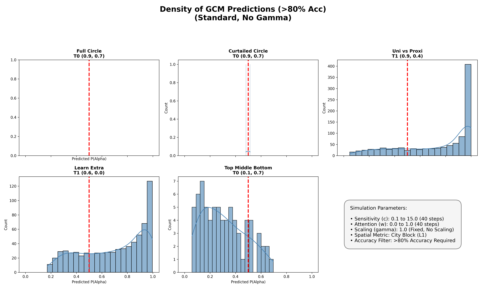
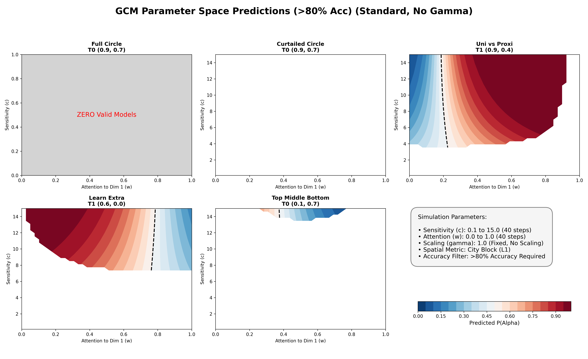
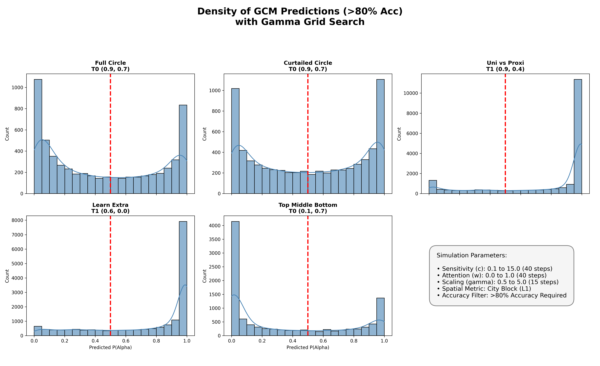
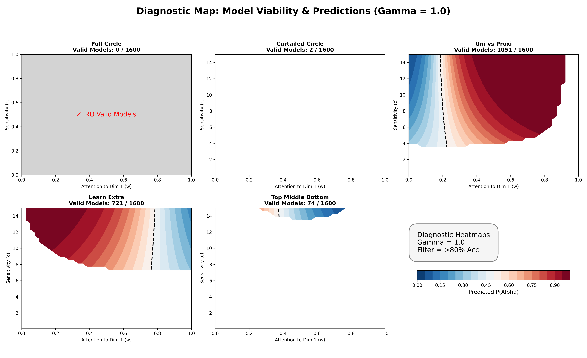
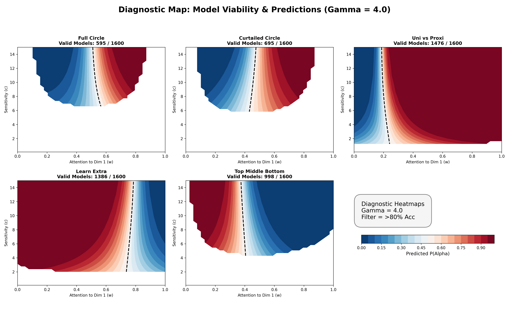

# Humans Know More Than Exemplar Models Do

## Supplementary Computational Modeling: Generalized Context Model (GCM)

To test whether an exemplar-based similarity mechanism can account for human generalization in our classification tasks, we mapped the full parameter space of the standard Generalized Context Model (GCM; Nosofsky, 1986). 

### Category Structures
For reference, the simulations below evaluate the critical test items across the following five category structures used in Experiment 1 and 2. 

*(Note: Alpha exemplars are designated as Category A, Beta exemplars as Category B. Critical test points are marked in the figures).*

  
  
  
  
  

---

### Simulation Methodology: The Parameter Grid Search

Rather than attempting to fit a single set of parameters to aggregated data—which can sometimes obscure the fundamental structural limitations of a model—we mapped the entire plausible parameter space of the GCM to observe its total behavioral repertoire. We conducted a grid search across thousands of parameter combinations per condition:

* **Attention Weight ($w$):** Ranged from 0.0 to 1.0. This controls the distribution of selective attention between the x and y spatial dimensions.
* **Sensitivity ($c$):** Ranged from 0.1 to 15.0. This controls the steepness of the exponential similarity generalization gradient.
* **Response Determinism ($\gamma$):** Ranged from 0.5 (undermatching probability, 1 would be standard probability matching) to 5.0 (highly deterministic maximizing).
* **Distance Metric:** City Block (L1), as established by prior independent scaling studies of this stimulus type.

#### The 80% Training Accuracy Filter
To ensure a valid comparison to human learners, the GCM must be subjected to the exact same behavioral standards as our human participants. We applied a strict exclusion criterion: any parameterization that failed to classify the labeled training items with at least 80% accuracy was discarded. 

**How is this calculated if the standard GCM doesn't "learn"?** Unlike error-driven models (e.g., ALCOVE), the standard GCM is a pure memory model that "learns" simply by storing all training exemplars in memory. To evaluate its training accuracy, we prompted the model to classify each of the stored training items based on its summed similarity to the rest of the category structures. If a parameter combination ($w, c, \gamma$) resulted in $<80\%$ accuracy on this baseline memory retrieval task, it means the model was incapable of representing the base categories without heavy interference. Because our human participants successfully learned these categories, these failed parameterizations were excluded from our simulations.

---

### Simulation Results

## 1. Standard GCM Predictions (Fixed $\gamma = 1.0$)

*The histograms below show the density of predictions for the parameter combinations that survived the filter.*

*The heatmaps below show the model's test predictions across the $w/c$ space. Gray areas indicate parameter combinations that failed the 80% training accuracy filter. Heatmaps that are blank but not gray, indicate that there were a few successful parameterizations, but not enough to build a heatmap.*

### Key Takeaways by Condition
#### 1. Full Circle & Curtailed Circle
 - **Structural Brittleness:** A baseline assumption of exemplar models is that they can readily represent category spaces. However, our simulation results reveal that the GCM is remarkably brittle when confronted with these specific spatial structures. For the **Curtailed Circle**, only 2 out of 1,600 parameter combinations (<1%) allowed the model to successfully pass the 80% training accuracy threshold. The GCM completely failed to represent the **Full Circle** condition structure. If a model structurally struggles to even represent the base training space across a vast array of parameters, it is a highly unlikely candidate for the mechanism humans use to acquire these categories.

#### 3. Uni Vs Proxi
 - **Implausible Parameter Values:** The vast majorty of parameterizations produce Beta responding. To get an Alpha response attention needs to be applied evenly (which is implasuible given the simple unidimensional solution), or selective attention needs to be applied to the size dimension (collapsing the shading dimension). This would result in the Alpha item at (0.0, 0.8) to be represented as a Beta. This error would passes the 80% filter, but human subjects do not struggle with this item.

#### 3. Top Middle Bottom
 - **Structural Brittleness:** The GCM largely failed to represent the "Top Middle Bottom" structure, with only 74/1600 parameterizations being successfull.
 - **Response misprediction:** Of the few parameterizations that were successful for the "Top Middle Bottom"structure, the majority of predictions predicted critical test item (0.1, 0.7) as being a Beta or at chance levels, with only a small minority getting to P(Alpha) no greater than ~0.7.
 - **Implausible Parameter Values:** In parameterizations where the model exhibited a P(Alpha)>0.5, selective attention was used along with extremely large sensitivity (c) values, suggesting that such performance was based purely on rote memorization in conjunction with strong selective attention- The shading dimension was collapsed and the nearest memorized item (along the size dimension) was an Alpha. This is implausible because  selective attention is a poor strategy for this structure. Relying on selective attention alone would result in failure-- The high sensitivity values are what allow the model to perform above 80%. Indeed, all successful parameterization have very high sensitivity values. High sensitivty values with more even attention is plausible, but high sensitivity with strong selective attention is less plausible. Psychologically, these two mechanisms serve contradictory goals. Selective attention is a strategy for cognitive economy and generalization, whereas high sensitivity reflects pure rote memorization with near-zero generalization. When applied to the Top-Middle-Bottom structure, collapsing either the X or Y axis causes the Alpha and Beta categories to artificially overlap in the center of the space. To successfully represent the categories (and pass our 80% accuracy filter) despite this self-inflicted overlap, the model must employ maximum sensitivity to rote-memorize the exact, hyper-specific 1D coordinates of every item. It is highly implausible that human learners would ignore a structurally vital dimension only to rely on a now handicapped rote memorization to resolve the resulting ambiguity.
 

#### 3. Learn Extra
 - **Implausible Parameter Values:** Human consistent predictions require either even attention (which is implausible due to the unidimensional solution), or the application of selective attention in opposition to the unidimensional solution (which is suboptimal and does not match human performance)

## 2. Expanded GCM Predictions (with $\gamma$ Grid Search)
*To test if response scaling could save the model's predictions, we expanded the search to a 3D volume, allowing $\gamma$ to range from 0.5 to 5.0.*

#### Diagnostic Heatmaps (Validating Extreme Parameters)
*To explicitly count valid models and investigate extreme predictions, we plotted specific $\gamma$ slices.*

---

### Key Takeaways by Condition

Our comprehensive mapping reveals three fundamental failures of the exemplar account when confronted with our experimental data:

#### 1. Full Circle & Curtailed Circle
 - **Structural Brittleness:** The majority of parameterizations still fail.
 - **Implausible Parameter Values:** Successfull parameterizations that produce a P(A)>0.5 require high sensitivity, selective attetnion, and gamma values. Selective attention is implausible for a circular structure. High sensitivity and selective attention produce near chance probabilities and then a high gamma pushes thoughs to the extremes-- model behavior is essentially random and unreliable.

#### 2. Uni vs Proxi 
 - Same analysis as above applies here, except high gamma does push some responses to be more extreme (same qualitative pattern though)

#### 3. Top Middle Bottom Stubborn Chance
 - Also the above analysis essentially holds with some the (implausible) parameterizations being pushed to more extreme values by the high gamma value

#### 3. Learn Extra
 - Above analysis also holds up (again just with exageration with gamma)
