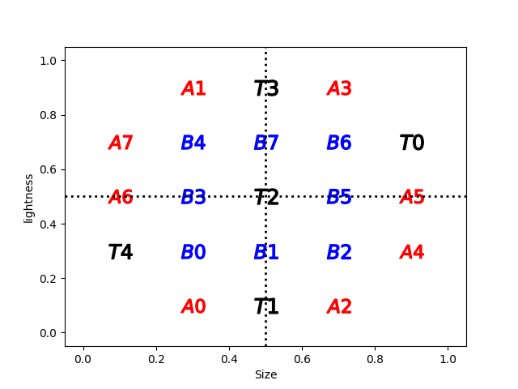
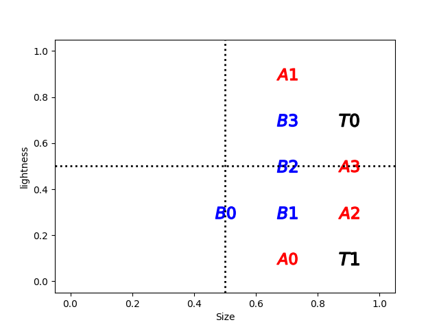
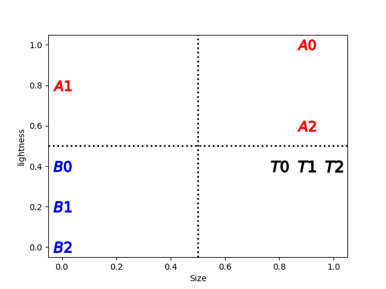
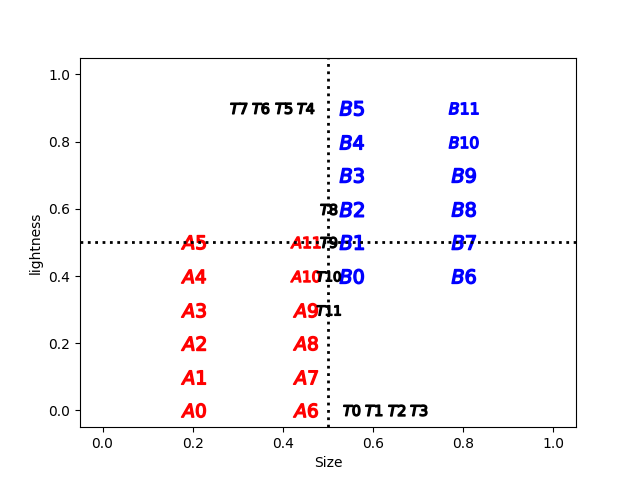
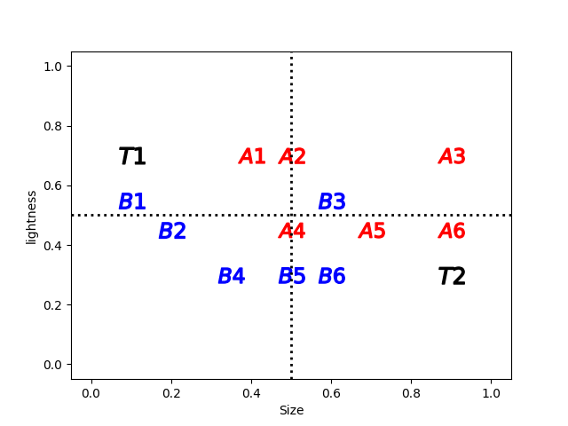
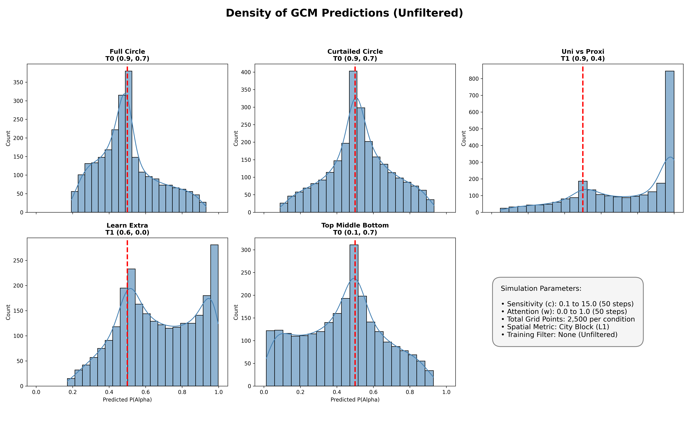
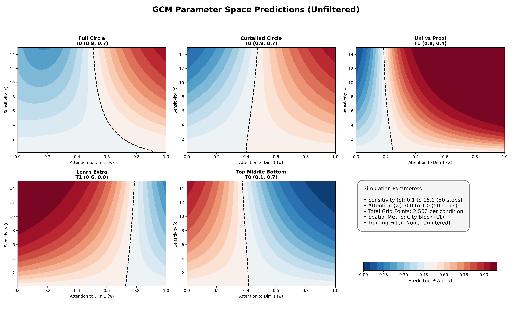
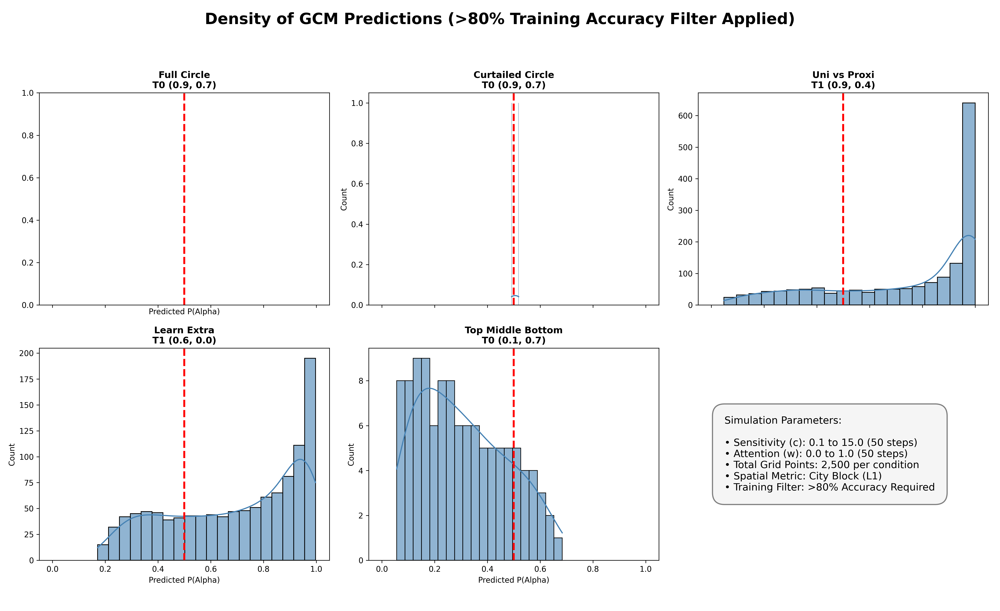
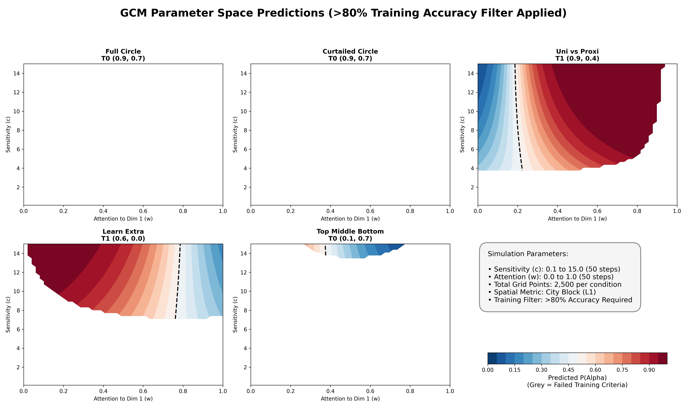

# Humans Know More Than Exemplat Models

## Computational Modeling: Generalized Context Model (GCM)

To test whether an exemplar-based similarity mechanism can account for human generalization in our classification tasks, we mapped the full parameter space of the standard Generalized Context Model (GCM; Nosofsky, 1986). 

### Category Structures
For reference, the simulations below evaluate the critical test items across the following five category structures used in Experiment 1 and 2. 

*(Note: Alpha exemplars are designated as Category A, Beta exemplars as Category B. Critical test points are marked in the figures).*

  
  
  
  
  

### Simulation Methodology: The Parameter Grid Search

Rather than attempting to fit a single set of parameters to aggregated data, we mapped the entire plausible parameter space of the GCM to observe the model's total behavioral repertoire. We conducted a grid search across 2,500 parameter combinations per condition:
* **Attention Weight (w):** Ranged from 0.0 to 1.0. This controls the distribution of attention between the x and y spatial dimensions.
* **Sensitivity (c):** Ranged from 0.1 to 15.0. This controls the steepness of the exponential similarity gradient.
* **Distance Metric:** City Block (L1), as established by prior norming studies of this spatial grid.

To provide a completely transparent evaluation, we analyzed the model's predictions in two distinct phases: an **Unfiltered** analysis of raw mathematical capacity, and a **Filtered** analysis restricting the model to psychologically plausible parameterizations.

---

### Phase 1: The Raw, Unfiltered Parameter Space

First, we evaluated the GCM's predictions across the entire parameter grid regardless of whether the model successfully "learned" the training categories. The plots below show the raw mathematical mechanics of the model. 

#### Unfiltered Prediction Density (Histograms)

#### Unfiltered Parameter Space Heatmaps

Looking strictly at the raw mechanics, the GCM appears highly flexible. However, this flexibility is theoretically misleading. A model's predictions on novel test items are only psychologically meaningful if the model has actually mastered the base training categories. 

---

### Phase 2: The Psychologically Plausible Parameter Space (>80% Accuracy Filter)

To ensure a valid comparison to human learners, the GCM must be subjected to the exact same behavioral standards as our human participants. We applied an exclusion criterion: any combination of sensitivity and attention weight that failed to classify the base training items with at least 80% accuracy was discarded. 

The filtered plots below show the model's *true* valid predictions.

#### Valid Prediction Density (Histograms)

#### Valid Parameter Space Heatmaps

---

### Key Takeaways by Condition
